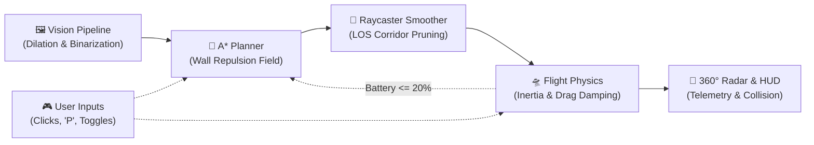
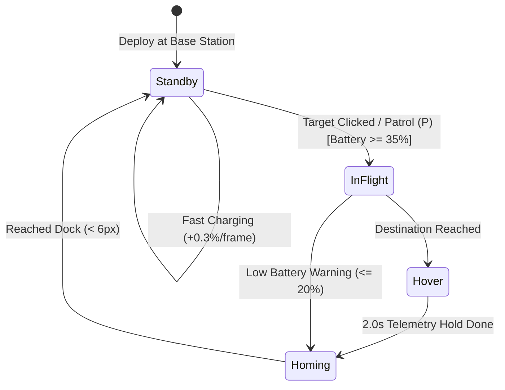
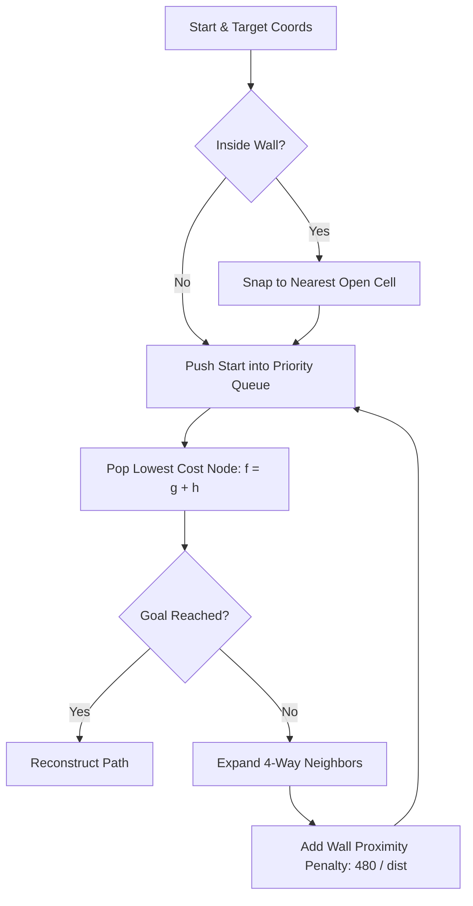
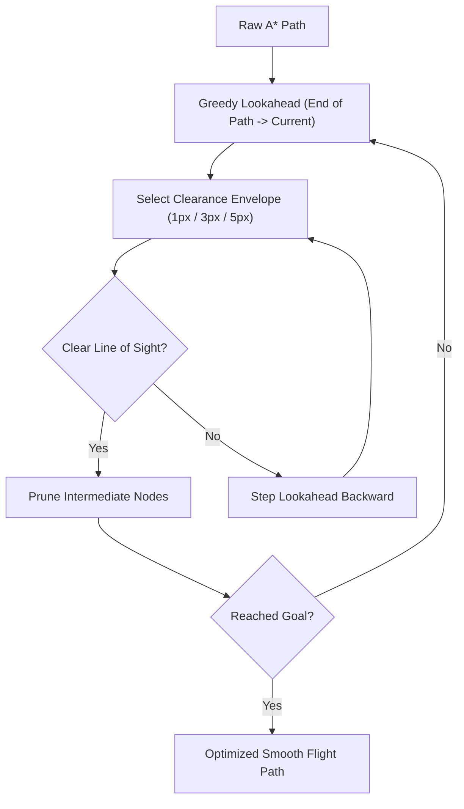
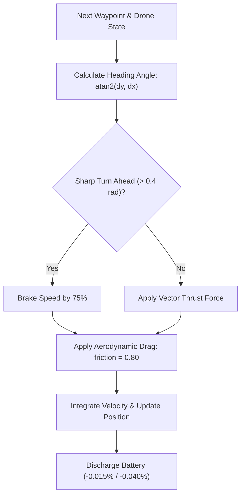
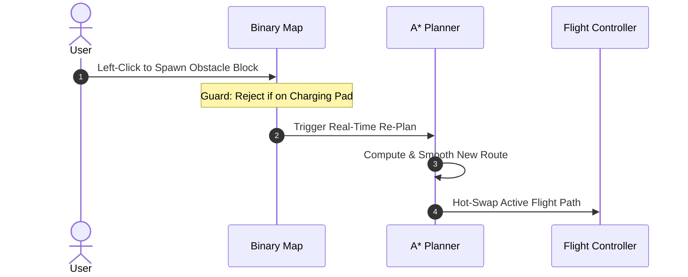
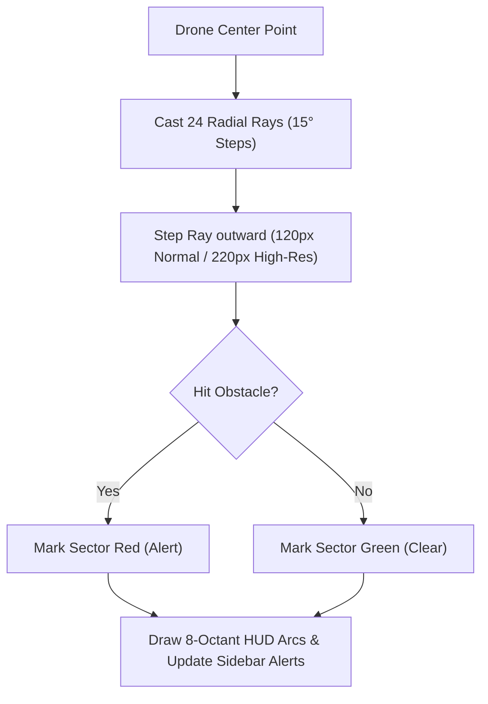

# 🚁 Autonomous Drone Autopilot & Navigation Simulator

<div align="center">

[](https://www.python.org/)
[](https://www.pygame.org/)
[](https://opencv.org/)
[](https://numpy.org/)
[](https://opensource.org/licenses/MIT)
[](https://github.com/kailash6207/drone-autopilot)

**A real-time autonomous robotics simulator built with Pygame featuring computer-vision floorplan ingestion, center-line biased A\* pathfinding, adaptive corridor raycasting, 2D vector flight physics, 360° proximity radar, and autonomous fail-safe docking.**

[Key Features](#-key-features) •
[System Architecture](#-system-architecture--pipeline-flowchart) •
[Mission Lifecycle](#-mission-lifecycle-state-machine) •
[Pathfinding & Smoothing](#-algorithmic-deep-dive--workflows) •
[Flight Physics](#-flight-physics--kinetics-engine-workflow) •
[Obstacle Avoidance](#-dynamic-in-flight-obstacle-injection-workflow) •
[Radar Array](#-360-octant-radar-sensor-array-workflow) •
[Flight Controls](#-flight-controls--sandbox-guide) •
[Installation](#-installation--getting-started)

</div>

---

## 📌 Overview

**Drone Autopilot** is a 2D autonomous robotic simulation environment designed to model realistic indoor unmanned aerial vehicle (UAV) navigation through complex architectural spaces. 

Instead of relying on idealized point-mass movement or trivial grid paths, the simulator implements an integrated robotics stack:
- **Floorplan Computer Vision Pipeline:** Extracts walkable corridors and inflates obstacle boundaries from raw architectural drawings.
- **Center-Line Biased A\* Planner:** Dynamic wall proximity penalty field repels paths away from tight doorframes and corners, routing the drone naturally through hallway centers.
- **Adaptive Corridor Raycaster Smoother:** Tapered line-of-sight corridor projection converts jagged grid steps into smooth continuous flight paths.
- **Kinetic Vector Flight Mechanics:** Inertial acceleration vectors, velocity caps, angular rotational interpolation, and high-traction aerodynamic drag eliminate drift and overshoot.
- **Fail-Safe Mission State Machine:** Autonomous mission lifecycle managing launch, point-to-point guidance, automated patrol loops, 2-second hover telemetry checks, emergency low-battery return-to-home (RTH), and fast inductive docking.
- **360° Octant Radar & HUD Diagnostics:** 24-ray radar sweep with real-time radial collision warning arcs around the drone chassis and live glass-cockpit telemetry.

---

## 🌟 Key Features

- **🧭 Center-Line Biased A\*:** 50,000 loop iteration headroom with dynamic inverse-distance wall repulsion ($\sum \frac{480}{\text{dist}}$) pulling trajectories to corridor center-lines.
- **📐 Adaptive Corridor Raycasting:** Greedy Bresenham line-of-sight smoother with distance-scaled clearance envelopes ($1\text{px}$, $3\text{px}$, $5\text{px}$) for natural, corner-safe flight paths.
- **🛸 Kinetic Vector Aerodynamics:** Rotational interpolation ($\Delta\theta \times 0.15$), aerodynamic drag damping (`0.80`), and curvature lookahead braking (75% throttle reduction when $|\Delta\theta| > 0.4\text{ rad}$).
- **📡 360° Octant Proximity Radar:** 24-ray radial scan with 8-sector status arcs around the chassis and toggleable range ($120\text{ px}$ Standard vs. $220\text{ px}$ High-Res).
- **🔋 Autonomous Mission Lifecycle:** Automated 2-second target hover validation, low-power emergency RTH ($\le 20\%$), inductive pad fast-recharge ($+0.3\%/\text{frame}$), and departure safety check ($\ge 35\%$).
- **🧱 Live Interactive Sandbox:** Dynamic in-flight obstacle spawning with instantaneous path recalculation, protected home base station, and geofence boundary warnings.

---

## 🏗️ System Architecture & Pipeline Flowchart

A neat, streamlined overview of the end-to-end simulation pipeline:



---

## 🔄 Mission Lifecycle State Machine

A concise view of the autonomous state transitions governing flight, hover delays, and docking:



---

## 🔬 Algorithmic Deep Dive & Workflows

### 1. Master A* Pathfinding Engine Workflow
Upgraded A\* search featuring adaptive start/goal relaxation and dynamic wall clearance repulsion:



#### Mathematical Cost Formulation
Every candidate cell $n$ is dynamically evaluated to naturally pull flight corridors toward hallway center-lines:

$$f(n) = g(n) + h(n) + \text{Penalty}_{\text{proximity}}(n)$$

$$\text{Penalty}_{\text{proximity}}(n) = \sum_{dx=-8}^{8} \sum_{dy=-8}^{8} \left\lfloor \frac{480}{\sqrt{dx^2 + dy^2}} \right\rfloor \quad \forall (px+dx, py+dy) \in \text{Walls}$$

---

### 2. Adaptive Tapered Corridor Raycaster Path Smoother
Prunes jagged 90° grid paths into clean flight vectors while dynamically scaling clearance corridors:



---

## 🛸 Flight Physics & Kinetics Engine Workflow

Every $60\text{ FPS}$ frame integrates thrust vectors, angular rotation interpolation, and drag friction damping:



---

## 🧱 Dynamic In-Flight Obstacle Injection Workflow

Real-time obstacle spawning with instantaneous mid-flight path recalculation:



---

## 📡 360° Octant Radar Sensor Array Workflow

The collision radar casts 24 radial rays to build an 8-octant spatial collision map around the drone chassis:



---

## 🎮 Flight Controls & Sandbox Guide

| Input | Action | Context & Behavior |
| :--- | :--- | :--- |
| **Left-Click (Map)** | **Initial Drone Deployment** | Spawns the drone and sets its permanent home charging dock station (must be clicked on open floor). |
| **Left-Click (Map)** | **Spawn Obstacle Block** | When deployed, spawns a $36\times 36\text{ px}$ obstacle block. Triggers immediate dynamic path recalculation in real-time. Protected: Cannot place over base station. |
| **Right-Click (Map)** | **Set Target Destination** | Computes smoothed vector trajectory to the clicked coordinate. If docked, initiates departure (requires $\ge 35\%$ battery). |
| **`[P]` Key** | **Toggle Auto Patrol** | Starts/stops autonomous surveillance loop through 7 residential waypoints across the property. |
| **Turbo Boost (UI)** | **Toggle Turbo Drive** | Increases speed ceiling ($3\times$) and acceleration ($3\times$); increases battery consumption ($2.67\times$). |
| **High-Res Radar (UI)** | **Toggle Radar Range** | Extends 360° sensor raycasting envelope from $120\text{ px}$ to $220\text{ px}$. |

---

## 🖥️ Telemetry & Dashboard Diagnostics

The persistent right-side HUD panel displays real-time glass-cockpit flight metrics:

```
+------------------------------------------------+
|           DRONE SYSTEM DIAGNOSTICS             |
+------------------------------------------------+
| SYSTEM STATUS:          ONLINE / OFFLINE       |
| FLIGHT MODE:            STANDBY / CRUISE / ... |
| TELEMETRY VELOCITY:     0.0 - 45.0 km/h        |
| RADAR COLLISION ALERTS: CLEAR / CRITICAL PROX  |
+------------------------------------------------+
| ONBOARD POWER RESERVES:                        |
| [=======================       ] 78.4%         |
+------------------------------------------------+
| HARDWARE MODULE UPGRADES:                      |
| [ CORE TURBO BOOST        ] (ON/OFF)           |
| [ HIGH-RES RADAR SENSOR   ] (ON/OFF)           |
+------------------------------------------------+
| INTERACTIVE COMMANDS:                          |
| [L-Click Map] Spawn Block Obstacle             |
| [R-Click Map] Smooth Vector Routing            |
| [P Key]       Toggle Auto Patrol               |
+------------------------------------------------+
```

### Telemetry State Descriptions
- **`AWAITING INITIAL DEPLOYMENT`**: Simulator initialized; waiting for initial left-click to place charging pad.
- **`STANDBY (READY TO FLY)`**: Drone safely docked on base pad with $\ge 35\%$ battery cushion.
- **`FAST CHARGING ON LOCK...`**: Drone docked on pad with $< 35\%$ battery; charging at $+0.3\%/\text{frame}$.
- **`MANUAL GUIDANCE`**: Autonomous navigation actively tracking a user-designated right-click waypoint.
- **`AUTO PATROL SURVEILLANCE`**: Continuous autonomous patrol executing multi-room surveillance waypoints.
- **`OBJECTIVE HOVER DELAY...`**: Reached target coordinates; holding position for 2,000 ms telemetry check.
- **`RETURNING TO CHARGING DOCK`**: Mission complete or low battery; returning to base station pad.
- **`GEOFENCE BREACHED!`**: Warning triggered when drone approaches within $25\text{ px}$ of simulator boundary.

---

## 📂 Project Structure

```bash
drone-autopilot/
├── config.py             # Global constants, window dimensions, grid resolution & color schemes
├── drone.py              # Drone physics model, kinetic equations, drag damping & quadcopter renderer
├── image_processing.py   # Floorplan ingestion, scaling, morphological dilation & grid binarization
├── main.py               # Main simulation loop, event dispatcher, HUD dashboard & mission state machine
├── pathfinding.py        # Master A* planner, proximity cost field & tapered corridor raycaster
├── requirements.txt      # Python dependencies (pygame, opencv-python, numpy, Pillow)
├── house.png             # Architectural floorplan source image
├── debug_map.png         # Diagnostic visual map output
└── images/
    └── house.png         # Scaled floorplan asset for runtime rendering
```

---

## 🚀 Installation & Getting Started

### Prerequisites
- **Python 3.10+** (Tested on Python 3.10, 3.11, and 3.12)
- Operating System: Windows, macOS, or Linux

### 1. Clone the Repository
```bash
git clone https://github.com/kailash6207/drone-autopilot.git
cd drone-autopilot
```

### 2. Set Up a Virtual Environment (Recommended)
```bash
# On Windows
python -m venv venv
venv\Scripts\activate

# On macOS / Linux
python3 -m venv venv
source venv/bin/activate
```

### 3. Install Dependencies
```bash
pip install -r requirements.txt
```

> **Requirements include:**
> - `pygame` (Rendering engine & window management)
> - `opencv-python` (Computer vision image handling)
> - `numpy` (High-performance array operations)
> - `Pillow` (PIL morphological image filtering & wall inflation)

### 4. Run the Simulator
```bash
# Windows
py main.py
# or
python main.py

# macOS / Linux
python3 main.py
```

---

## ⚙️ Configuration & Customization

All primary operational parameters can be customized in [`config.py`](file:///D:/VSCODE/drone-autopilot/config.py):

| Parameter | Default | Description |
| :--- | :--- | :--- |
| `WINDOW_WIDTH` | `1300` | Total application window width in pixels (Map + HUD sidebar). |
| `MAP_WIDTH` | `1000` | Width allocated to the floorplan navigation canvas. |
| `WINDOW_HEIGHT` | `700` | Window and canvas height in pixels. |
| `GRID_SIZE` | `4` | Discretization resolution in pixels per pathfinding grid cell. |
| `DRONE_SPEED` | `4` | Base maximum speed constant for drone movement. |
| `DRONE_SIZE` | `20` | Reference diameter for drone collision footprint. |

### Using a Custom Floorplan
1. Place your floorplan image in `images/` (PNG, JPG, or BMP format).
2. Ensure black/dark pixels represent walls and white/light pixels represent open walkable space.
3. Update the file path in [`main.py`](file:///D:/VSCODE/drone-autopilot/main.py#L24-L26):
   ```python
   binary_map = process_floorplan("images/your_floorplan.png")
   floorplan_image = pygame.image.load("images/your_floorplan.png")
   ```

### Modifying Surveillance Waypoints
To alter the automated patrol route, edit the `WAYPOINTS` array in [`main.py`](file:///D:/VSCODE/drone-autopilot/main.py#L42-L45):
```python
WAYPOINTS = [
    (150, 200), (150, 600), (450, 200),
    (550, 200), (550, 600), (800, 400), (800, 600)
]
```

---

## 🗺️ Roadmap & Future Enhancements

- [ ] **Dynamic Moving Obstacles:** Add non-player entities (pets, humans) with real-time Velocity Obstacle (VO) evasion.
- [ ] **Multi-Agent Swarm Mode:** Coordinate multiple autonomous drones with inter-agent collision avoidance (ORCA/RVO).
- [ ] **Fog of War & SLAM:** Real-time Simultaneous Localization and Mapping (LIDAR raycast unmasking of unknown layouts).
- [ ] **Full PID Controller:** Altitude and thrust vector tuning with configurable proportional, integral, and derivative gains.
- [ ] **3D Flight Simulation:** Expand into 3D voxel spaces with 6-DOF (Degrees of Freedom) aerodynamics.

---

## 🤝 Contributing

Contributions, issues, and feature requests are welcome!

1. Fork the Project: `git checkout -b feature/AmazingFeature`
2. Commit your Changes: `git commit -m 'Add some AmazingFeature'`
3. Push to the Branch: `git push origin feature/AmazingFeature`
4. Open a Pull Request

---

## 📜 License

Distributed under the **MIT License**. See `LICENSE` for more information.

---

<div align="center">
Developed by <b><a href="https://github.com/kailash6207">Kailash</a></b> • Built with Python & Pygame
</div>
